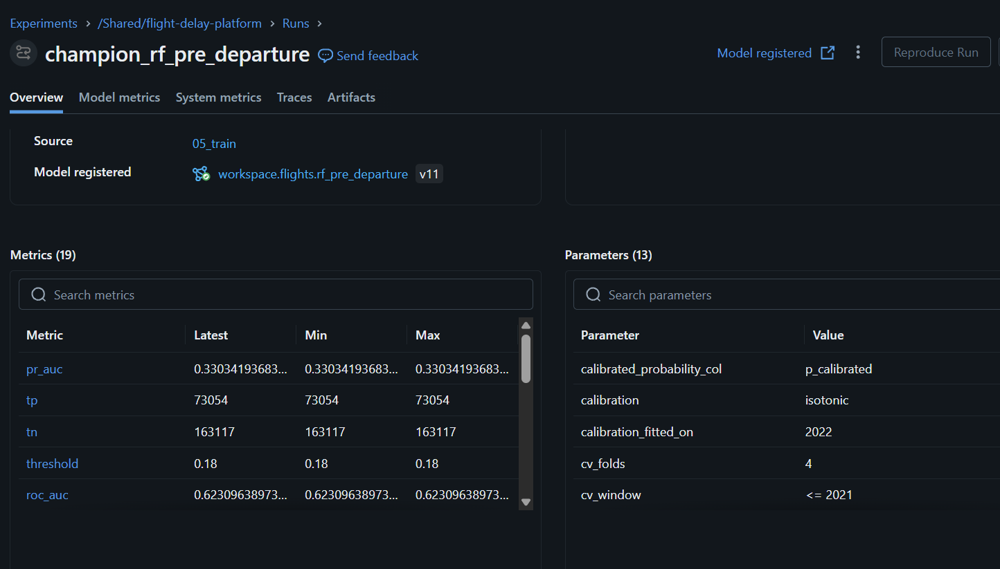
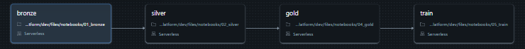
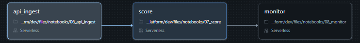
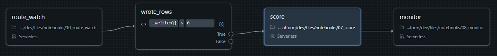
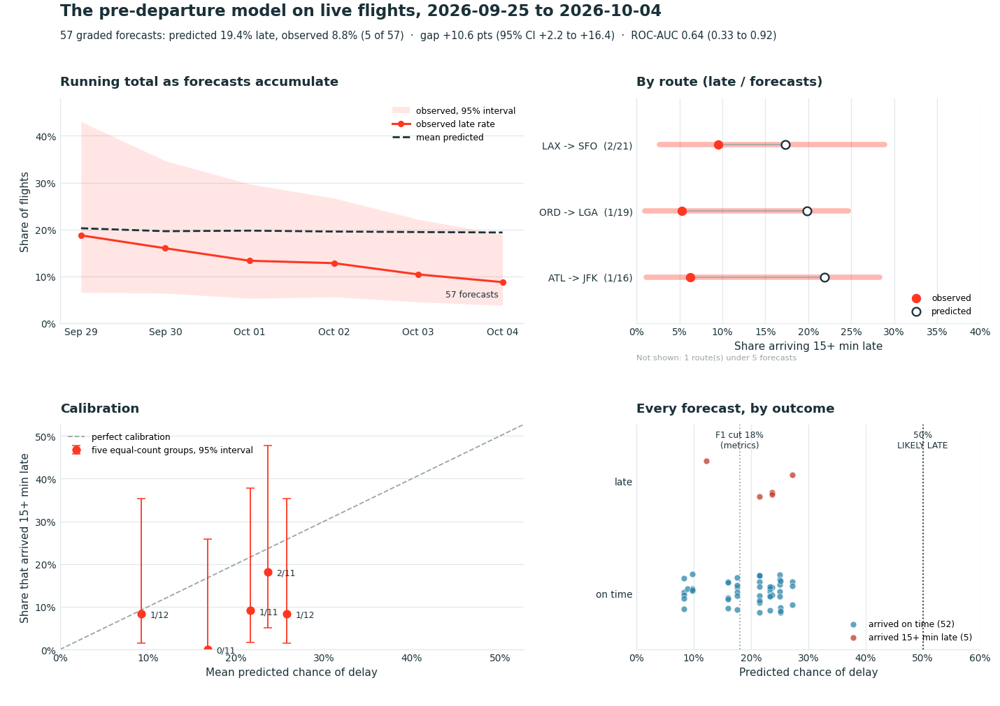

# Flight Delay Prediction Platform

[](https://github.com/OmaryElkady/Data-Science-Capstone/actions/workflows/ci.yml)


A Bronze→Silver→Gold Delta pipeline over 3M BTS flight records, feeding two Spark ML models
registered in Unity Catalog and served against live flights from two APIs.

---

## Abstract

Two models answer the same question at different moments. The **in-flight** model knows the
actual departure delay; the **pre-departure** model does not, and is the only one that is
useful before an aircraft leaves the gate.

The in-flight model scores **0.9258 test ROC-AUC**. A logistic regression on `dep_delay`
*alone* scores **0.9261**. The 818 other engineered features buy **`-0.0003`** — they make it
very slightly worse than the one-feature baseline.

That result is the project's spine. It would have been easy to report "0.93 AUC flight delay
predictor" and stop; the baseline is what makes that claim indefensible, and running it is
what redirected the work. The pre-departure variant — where the features have to do the
work — scores **0.6231 test ROC-AUC, 0.4010 F1** against a majority-class floor of 0.5.

Everything downstream follows from taking that honestly: a temporal split because delay
cascades within an operating day, a third window because the decision threshold cannot be
chosen on data the model trained on, a tie rule because a margin inside fold noise is not a
result, and a threshold of 0.18 rather than 0.5 because at 0.5 the pre-departure model
predicts almost nothing and scores **F1 = 0.0031**.

Then the models meet flights that did not exist when they were trained. A scheduled job
forecasts three busy routes every morning and grades each forecast once the flight lands.
Over the first 57 graded pre-departure forecasts the model **over-forecast delay**: it
expected 19.4% to arrive late and 8.8% did, a gap whose 95% interval (+2.2 to +16.4 points,
resampling whole days) excludes zero. Its 0.638 ROC-AUC matches the 2023 test set, but on five
late flights the interval runs from 0.33 to 0.92, so the ranking is not established either way
yet. See [Forward test](#forward-test-2026-flights).

---

## Architecture

```
  BTS extract (3,000,000 rows, 33 cols)          AeroDataBox            OpenSky Network
         │                                    schedules + gate           /states/all
         │                                        times                       │
         ▼                                           │                        │
  ┌─────────────┐                                    │              7,540 aircraft, 1 call
  │   BRONZE    │  raw, replayable                   │              667 ground / 6,873 air
  │  3,000,000  │  no casts, no drops                │                        │
  └──────┬──────┘                                    ▼                        ▼
         │                                    ┌──────────────────────────────────┐
         ▼                                    │        API BRONZE / SILVER       │
  ┌─────────────┐                             │  flight + alternatives + phase   │
  │   SILVER    │  2,520,650 rows             └────────────────┬─────────────────┘
  │  cleaned +  │  2020 dropped (COVID)                        │
  │  enriched   │  broadcast date dimension                    │
  └──────┬──────┘  CHECK constraints, ZORDER                   │
         │                                                     │
         ▼                                                     │
  ┌─────────────┐                                              │
  │    GOLD     │  2,463,979 labelled rows                     │
  │  feature    │  819-slot vector                             │
  │   store     │  feature manifest (the contract)             │
  └──────┬──────┘                                              │
         │                                                     │
         ▼                                                     │
  ┌──────────────────────┐                                     │
  │      05_train        │   CV ≤2021 │ threshold 2022 │ test 2023
  │  blocked CV, TPE     │                                     │
  └──────────┬───────────┘                                     │
             ▼                                                 ▼
    ┌──────────────────┐                          ┌────────────────────────┐
    │  Unity Catalog   │◄──── models:/…@champion ─│       07_score         │
    │  rf_pre_departure│      threshold read off  │  verdict + alternatives│
    │  rf_in_flight    │      the model version   └────────────────────────┘
    └──────────────────┘
```

### Component table

| Layer | Notebook | Writes | Row count |
|---|---|---|---|
| Bronze | `01_bronze` | `bronze_flights` | 3,000,000 |
| Silver | `02_silver` | `silver_flights` | 2,520,650 |
| Gold | `04_gold` | `gold_ml_features`, `feature_manifest` | 2,463,979 / 819 |
| Training | `05_train` | 2 UC models + `@champion` aliases | — |
| Ingest | `06_api_ingest` | `api_silver_flights`, `opensky_states` | per run |
| Scoring | `07_score` | `flight_delay_predictions`, `alternative_flight_recommendations` | per run |
| Monitoring | `08_monitor` | `prediction_monitoring` | resolved forecasts |
| Route watch | `10_route_watch` | `api_silver_flights` (`row_kind = 'watch'`) | 3 routes daily |
| EDA | `03_eda` | nothing — analysis only | — |

---

## Why Delta, not Parquet

Every one of these is used in the pipeline, not listed aspirationally.

| Feature | Where | Why |
|---|---|---|
| `CHECK` constraints | Silver, Gold | The filters are invariants. `ALTER TABLE ADD CONSTRAINT` validates existing rows, so a clean run *is* the data-quality assertion |
| `OPTIMIZE … ZORDER` | Silver, Gold | Every training split filters `flight_year`; Z-ordering lets those filters skip files |
| `MERGE` | Predictions | Upsert keyed on the flight and the model that made the forecast — a re-run refreshes a forecast instead of duplicating it, and an outcome reaches every forecast made about that flight |
| Time travel | Silver | `DESCRIBE HISTORY` answers "did this number move because the model changed or the data did?" |
| `autoOptimize` | Silver, Gold | Reasonable file sizes on write instead of a compaction job later |

---

## Results

All figures from `fast_mode=false` runs. Test window is **2023-01-01 to 2023-08-31** — the
source extract ends there, so the holdout is 8 of 12 months and contains neither Thanksgiving
nor Christmas. It is reported that way rather than as "the 2023 holdout".

| Model | Test ROC-AUC | PR-AUC | F1 | Precision | Recall | Threshold |
|---|---|---|---|---|---|---|
| Majority class | 0.5000 | — | 0.0000 | — | — | — |
| **`dep_delay` alone (logistic)** | **0.9261** | — | 0.8067 | — | — | 0.50 |
| In-flight (RF, 819 slots) | 0.9258 | 0.8844 | 0.8137 | 0.8749 | 0.7605 | 0.40 |
| **Pre-departure (RF)** | **0.6231** | 0.3303 | 0.4010 | 0.2813 | 0.6980 | 0.18 |

**Lift of the in-flight model over one feature: `-0.0003`.** Not "small" — *negative*. Every
piece of feature engineering in this project, applied to the variant that already knows the
departure delay, produces a model fractionally worse than a logistic regression on that one
column. Both numbers sit well inside noise, which is the point: they are the same model.

Pre-departure cross-validates at **0.6165 ± 0.0325** against a test score of 0.6231 — a gap of
`+0.0066`, well inside one fold standard deviation. It generalises.

The in-flight CV mean is **0.8463 ± 0.1166** against a test score of 0.9258, and the notebook
refuses to quote the mean on its own: the spread is larger than most of the differences anyone
would want to read off it. Stratifying the folds within each year brought that spread down
from 0.1517 but did not remove it, and `05_train` checks the obvious explanation and rules it
out — the folds differ by only **3.34%** in delay rate and **3.96 minutes** in mean
`dep_delay`, so fold composition is not what is moving the score.

Every figure here is also on the MLflow run that registered the champion. The pre-departure run
below links to `workspace.flights.rf_pre_departure` v11, shows the PR-AUC, ROC-AUC and 0.18
threshold from the table, and records the isotonic calibration fitted on 2022.



### Threshold

Selected on the 2022 window, measured there, then applied unchanged to 2023.

| | Pre-departure | In-flight |
|---|---|---|
| F1 at the tuned threshold | 0.3773 @ 0.18 | 0.8098 @ 0.40 |
| F1 at Spark's default 0.50 | **0.0031** | 0.8040 |
| Cost of the default | **+0.3742 F1** | +0.0057 F1 |
| Within 1% of best F1 | 0.17 – 0.21 | 0.30 – 0.50 |

At 0.5 the pre-departure model predicts almost nothing. Both optima are plateaus rather than
peaks, which is worth more than the point estimate: anything in those bands performs the same,
so the exact cut is not load-bearing and a reader should not treat 0.18 as precise.

The window is carved out *before* cross-validation, because `CrossValidator.fit()` refits
`bestModel` on its entire input and any CV fold is therefore in-sample by the time a champion
exists.

**The call a person sees is made at 50%, not at the F1 cut.** The probabilities are
calibrated, so a flight is more likely late than not exactly when its probability reaches 0.5,
and that is where `07_score` calls it `LIKELY LATE`. The F1 cut stays where every metric above
was computed.

`05_train` also tags each model version with an "advisory" cut: the lowest threshold at which
at least half of the flights *above* it turn out late. That answers a different question, and
it was the wrong one to put in front of people. The share is an average over everything above
the cut, dominated by near-certain flights, so it says nothing about the flight sitting at it.
For the in-flight model it came out at **0.07** (precision 0.522, recall 0.886), and the board
labelled a flight with a 14.9% chance of delay as DELAY EXPECTED. The tag is kept on the model
for the record and no longer drives the label.

For the pre-departure model the same rule found nothing usable: the best threshold reaching
50% precision is 0.48, and it catches **0.5%** of delayed flights while flagging 0.21% of all
flights. A 0.62-AUC model is almost never more likely right than wrong when it calls a flight
late, and a 50% call says exactly that — its forecasts come out `LIKELY ON TIME`, with the risk
carried by the percentage and the comparison against the rest of the route.

### Calibration

Isotonic regression, fitted on 2022 and applied to 2023. **It works for one model and not
the other, and the honest reading is not the same in both columns.**

| | Pre-departure raw | Pre-departure calibrated | In-flight raw | In-flight calibrated |
|---|---|---|---|---|
| Largest bin deviation | 0.0760 | 0.0890 | 0.0950 | **0.0286** |
| Brier score | 0.1750 | **0.1712** | 0.0638 | **0.0632** |
| Test ROC-AUC | 0.6231 | 0.6231 | 0.9258 | 0.9258 |

For the in-flight model it does what it is supposed to: bin deviation falls by a factor of
more than three.

For the pre-departure model the two measures **disagree**. The Brier score improves, and Brier
is a proper scoring rule — it cannot be gamed by a calibration map that makes the summary
statistic look better. The largest single bin deviation gets worse. The most likely reading is
that the miscalibration is not stable between 2022 and 2023, so a map fitted on one year is
partly mis-applied to the next; `05_train` says exactly that rather than quietly reporting
whichever number flatters the method.

It ships anyway, on the strength of the proper scoring rule and because the alternative is
serving a probability the threshold was not selected against. That is a judgement, and it is
recorded here as one.

ROC-AUC cannot move in either column: isotonic regression is monotonic, so it corrects
confidence without reordering anything.

**What reading the wrong column would have cost.** The threshold is selected on
`p_calibrated`. Applying that same 0.18 to the raw probability instead — one number, two
scales, no error anywhere — gives F1 **0.3516** against **0.4010**, and flags 26.9% of flights
instead of 57.1%. An earlier version of `05_train` did precisely that: it selected on raw
scores, reported on raw scores, then registered a calibrated pipeline tagged with the raw-scale
cut.

The calibrator is a *stage of the registered model*, not a measurement beside it. `05_train`
appends it to the champion's own fitted stages and registers the combined pipeline, so the
artifact in Unity Catalog serves `p_calibrated` and `07_score` reads that column. The
decision threshold is selected on the same scale, before any metric is reported: choosing a
cut against raw scores and then serving remapped ones is wrong on every row and raises
nothing.

---

## What the EDA decided

`03_eda` sizes each opportunity before anything is built.

**Delay causes**, over 489,792 delayed flights and 33,315,131 delay minutes:

| Cause | Share of delay minutes | Share of delayed flights |
|---|---|---|
| Late aircraft | **38.4%** | 49.8% |
| Carrier | 36.2% | 56.1% |
| NAS (airspace/ATC) | 19.3% | 47.7% |
| Weather (extreme) | **5.8%** | 5.8% |
| Security | 0.2% | 0.5% |

Late aircraft is delay *propagating*, and the share climbs from **15.2% before 09:00 to 44.4%
after 18:00** — the cascade made visible. Late aircraft plus NAS is **57.7%** of delay
minutes and needs no external data, which is why congestion features came before any weather
API. Extreme weather is 5.8%, and a pre-departure model would have a *forecast* at inference
time rather than the observation it trained on.

**Other findings:** hour-of-day risk spans 8.5% at 05:00 to 28.1% at 19:00 (3.3×);
`dep_delay` correlates 0.967 with arrival delay against 0.097 for the next feature; a
do-nothing classifier scores 80.1% accuracy, which is why accuracy is never the headline.

**A negative result, kept:** the three engineered holiday flags move the delay rate by
+0.21pp, −0.42pp and +0.87pp against a ~20% base rate. `is_near_holiday` is *negative*. They
remain in Silver as a general cleaned layer, and the feature selector discards them. Nothing
in this README claims they helped.

---

## Design decisions

**Temporal split, not random.** Delay cascades within an operating day, so a random split
puts the 07:00 departure that caused a delay in train and the 14:00 flight it delayed in
test. CV ≤2021, threshold 2022, test 2023.

**Blocked CV folds.** `CrossValidator` partitions randomly by default, which reintroduces
exactly the leak the outer split removed. `foldCol` supplies contiguous quarters instead.
Two fold columns exist, at `CV_FOLDS` and `SEARCH_CV_FOLDS` granularity, because the values
must be exactly `[0, numFolds)` and the search stages use fewer folds than the confirming one.

**The one-standard-error rule.** The K sweep's argmax moved between runs (10, then 40) while
every candidate stayed inside one standard deviation. The selected K did not move. Picking
the argmax would have crowned fold noise.

**A tie rule that is applied, not printed.** Both variants tied on margin against pooled fold
sd (0.0030 vs 0.0151; 0.0031 vs 0.2195), so both champions are random forests — bagging is
parallel and cheaper to serve than sequential boosting. Registering the argmax of a margin
under a fifth of a standard deviation would be registering noise.

**Feature manifest as a contract.** `ml_attr` metadata does not survive `StandardScaler` plus
a Delta round-trip — confirmed empirically. `04_gold` writes one row per vector slot and
`05_train` reads it, so a magic index cannot drift into target leakage.

**The same ruler on both sides.** BTS `DISTANCE` is statute miles, and AeroDataBox reports the
same quantity in metres, kilometres, miles and nautical miles at once. Reading the wrong field
raises nothing: it puts a plausible number in the right column describing a different flight.
ATL-IAH is 689 miles and 1,109 km, and a model trained on miles reads 1,109 as a flight about
as long as Atlanta to Denver. Units are part of the feature contract, and the unit test pins
them.

**A flight is identified by the flight.** Carrier, number, date and route — not the day you
asked. A flight number is not a flight: DL1572 can fly ATL->IAH in the morning and IAH->ATL in
the afternoon, and a key without the route silently merges them. A key with the *scoring run's*
date has the opposite failure: the forecast and the outcome land on separate rows, because
almost any flight worth grading lands on a different calendar day from the one its forecast was
made on. Within a flight, each model's forecast is its own row, so a later in-flight score
never replaces the pre-departure claim made before it.

**Two APIs, by phase.** AeroDataBox answers *how late* on gate semantics — the same quantity
BTS records as `DEP_DELAY`. OpenSky answers *where and what phase*: one call returned 7,540
aircraft, and `on_ground` is the split the two models need. Deriving delay from ADS-B would
give wheels-off, which differs by taxi-out and is worst at the congested airports where delay
matters most.

**Airframe matching.** AeroDataBox returns `aircraft.modeS`, which is OpenSky's `icao24`.
Matching on it identifies a specific aeroplane rather than a flight number — codeshares share
a number but never an aircraft.

**Local clocks for clock features.** BTS records `CRS_DEP_TIME` as local time at the origin,
so the model learned hour-of-day risk on a local clock. Durations and delays use UTC, where
subtracting two instants is unambiguous across a DST boundary.

---

## Engineering

**Python UDFs → broadcast join.** Four UDFs ran per row across 2.5M rows; all four flags are
functions of the date, and there are only 1,704 distinct dates. Materialising a date
dimension in the driver and broadcasting it moved the work into the JVM:

```
4 Python UDFs   :   37.79s
broadcast join  :    1.38s
speedup         :   27.29x          (200,000-row sample, .write.format("noop"))
```

`build_date_dimension` is unit-tested against the very helpers it replaces across every day
of 2019, so the refactor is proven rather than hoped for. `spark_day_of_week` pins Spark's
1=Sunday convention against Python's 0=Monday — a silent one-day shift otherwise.

**241 tests**, no cluster required. Fixtures are recorded live payloads, so the parsers are
tested against the shape the APIs actually return.

---

## CI

[](https://github.com/OmaryElkady/Data-Science-Capstone/actions/workflows/ci.yml)

Everything here *runs* on Databricks. Nothing runs in GitHub Actions, and the split is
deliberate:

| | GitHub Actions | Databricks |
|---|---|---|
| Checks | code, notebook structure, job definitions | the actual pipeline |
| Needs | nothing | Spark, Unity Catalog, a 3M-row volume, three API secrets |
| Cost | free, every commit | metered, deliberately triggered |
| Time | under a minute | minutes to hours |

CI therefore never executes `01`-`08`. It cannot. What it can do is catch every failure that
does not need a cluster, and four jobs do that:

- **Lint** - `flake8` on `src/` and `tests/`, `nbqa flake8` on the notebooks
- **Unit tests** - 241 tests with coverage. `src/*.py` holds no module-level `SparkSession`,
  by design, which is what lets the suite run without installing PySpark
- **Notebook contracts** - `tools/validate_notebooks.py`: every cell parses, every
  `config.X` resolves, every notebook carries its contract header, and no cell reads a name
  that no earlier cell binds
- **Databricks bundle** - `databricks bundle validate` when workspace credentials are
  present, plus `tools/validate_bundle_paths.py`, which needs none

That last check exists because the bundle really did break. The notebooks were renumbered,
`databricks.yml` kept pointing its silver task at `./notebooks/03_silver.ipynb`, and
`databricks bundle deploy` - the command this README tells you to run - failed. The
credential-free half of the check catches that on a fork, on an outside PR, and on any clone
without a Databricks account.

The test suite is Spark-free for the same reason the notebooks are not run here: a CI job
that needs a cluster is a CI job nobody keeps green.

---

## Reproducing

**Prerequisites:** Databricks Free Edition, serverless environment version 5 (required for
`pyspark.ml` and `mlflow.spark`), `flights_sample_3m.csv` in `/Volumes/workspace/flights/raw/`.

```bash
databricks secrets create-scope flights
databricks secrets put-secret flights aerodatabox_key
databricks secrets put-secret flights opensky_client_id
databricks secrets put-secret flights opensky_client_secret
```

Run `00_setup` - it makes one live call per API and reports quota. Then `01_bronze` -> `02_silver`
-> `04_gold` -> `05_train`. `03_eda` reads and writes nothing and can run at any point.

For live scoring, `06_api_ingest` takes **one required input** - a flight number - plus a
date and two optional tie-breakers:

```
FLIGHT_NUMBER   DL1572          (dl1572, DL 1572, DL-1572 all work)
FLIGHT_DATE     2026-09-14      today is the only date a live aircraft match can succeed
ORIGIN          ATL             optional - only needed if the number flies >1 leg that day
DESTINATION     IAH             optional - same
```

Origin, destination, times, distance (in statute miles, matching BTS), aircraft and both
OpenSky join keys are derived from the flight number. `ORIGIN`/`DESTINATION` do not cost a
call and are not a lookup - they only pick between legs the same response already returned.
See **Using it** below.

The live tables are disposable. `api_silver_flights`, `flight_delay_predictions`,
`alternative_flight_recommendations` and `prediction_monitoring` are all rebuilt by `06` →
`07` → `08`, which create them if they are absent. Dropping them costs one ingestion and no
retraining: Bronze, Silver, Gold, the feature pipeline and the registered models are
untouched by the live path.

### Jobs are defined in code, not in the UI

`databricks.yml` is a Databricks Asset Bundle, and it is the source of truth for all three jobs.
Deploying it creates them in the workspace, where they behave exactly like jobs built by
clicking: they appear under **Jobs & Pipelines**, run from the UI, and show the same run
history and task graph. The difference is where the definition lives - a job built in the
form exists only in one workspace, cannot be reviewed, and cannot be validated by CI.

```bash
pip install databricks-cli          # or: brew install databricks/tap/databricks
databricks auth login --host https://<your-workspace>.cloud.databricks.com

databricks bundle validate -t dev   # parses, resolves every notebook_path
databricks bundle deploy   -t dev   # creates/updates all three jobs in the workspace
```

The jobs then appear as `[dev <your-username>] flight-delay-training`,
`[dev <your-username>] flight-delay-scoring` and `[dev <your-username>] flight-delay-route-watch`.
Run them from the UI, or:

```bash
databricks bundle run flight_delay_training -t dev
```





**What `mode: development` does for you.** It prefixes job names so a deploy cannot collide
with anything else in the workspace, and it force-pauses every schedule. That is why the
bundle has a second target. `prod` uses `mode: production`, which deploys schedules as
written, so the route watch's daily run starts on deploy:

```bash
databricks bundle deploy -t prod
```

A bundle-deployed job is locked in the UI (its **Resume** button is disabled), so pausing it
is a deploy too: `databricks bundle deploy -t prod --var watch_schedule=PAUSED`. The schedule
lives in code in both directions.

**One gotcha worth knowing.** `bundle deploy` uploads the notebooks from your *local working
tree* to a bundle-managed workspace path, and the deployed job runs that copy - not the
Databricks Git folder you edit in. So the loop is: edit in the Git folder, commit and push
from there, `git pull` locally, then `bundle deploy`. Skipping the pull deploys whatever your
local checkout last had. (A job can instead be pointed at a `git_source` so it pulls the
branch at run time, which removes the step at the cost of making every run depend on GitHub.)

Training is manual and expensive - a full `05_train` run is a 25-trial TPE search plus blocked
CV on ~1.3M rows. Scoring one flight is manual and cheap. The route watch is the only
scheduled job, and it runs only from the `prod` target.

---

## Using it

The pipeline answers one question - *will this specific flight arrive 15+ minutes late* - and
the answer depends on **when you ask relative to the flight**. That is not a quirk of the
implementation; it is the whole finding. Before pushback nobody knows the departure delay, and
that single fact is worth 0.30 ROC-AUC.

### Run 06, then 07. Always in that order.

`06_api_ingest` fetches. `07_score` scores what was fetched. `07` on its own re-scores the
last ingestion, which is useful for re-reading a result and useless for asking about a new
flight.

### When to run it, and what you get

| When you run `06` + `07` | `dep_delay` | Model used | What you get |
|---|---|---|---|
| Days before departure | unknown | pre-departure | The honest forecast: schedule, route, carrier, time of day. **This is the intended use.** |
| Within a few hours of departure | usually still unknown | pre-departure | Same forecast, plus live FAA airspace conditions for the origin and destination |
| After pushback, before landing | known | in-flight | A much stronger estimate - the model that knows how late the aircraft actually left |
| After it lands | known | in-flight | No longer a forecast: a score made with hindsight is marked retrospective and never graded. The `OUTCOME` block grades the forecasts made before it |

**So: no, do not wait until the flight has landed.** Landing is when the answer stops being a
prediction. Run it before departure for the number you can act on; run it again afterwards
only if you want to see the forecast checked against what happened. `07_score` prints that
check automatically whenever `arrival_delay` has been filled in, so a second run after arrival
is how the project closes its own loop - one flight at a time, accumulating in
`flight_delay_predictions`.

**The second run can be any day** inside the provider's few-day lookback, as long as it uses the
same flight number and the flight's own date. `FLIGHT_DATE` defaults to today, so set it by
hand. A forecast is keyed on the flight — carrier, number, date and route — and on the model
that made it, not on the day it was made. A flight scored before departure and again in the
air therefore holds two forecasts; when it lands the outcome is written to both, and
`08_monitor` grades each against its own model. A graded forecast is frozen: the outcome pass
writes the observations and leaves the probability, thresholds, model versions and recorded
airspace conditions exactly as they were.

**What counts as observed comes from the provider's status, not its times.** AeroDataBox
publishes a revised departure and arrival time long before either happens — they are the
airline's current estimate. `dep_delay` is taken as observed only once the status says the
aircraft has departed, and `arrival_delay` only once it says `Arrived`. Until then the
estimates are kept separately as `estimated_dep_delay` and `estimated_arrival_delay`, and
nothing is graded against them.

### The API cannot see far ahead

AeroDataBox serves a window around today - a few days back, fewer forward. Outside it, a flight
number returns no legs and `06` stops with a message naming the date and the number rather than
writing an empty table. Practically:

- **A date more than a few days out will not resolve.** Ask again closer to the day.
- **Today is the only date the OpenSky match can succeed.** A live ADS-B snapshot contains
  aircraft that are moving now; a flight from another day is not in it at all. On any other
  date the phase comes back `unknown` and everything routes to the pre-departure model, which
  is correct behaviour, not a failure.
- **A past date works** and comes back with actual times filled in.

### When the flight is not found

`06` raises with the number and the date rather than guessing. In order of likelihood:

1. **Date outside the provider's window.** Move it nearer to today.
2. **The number does not operate that day.** Many are not daily.
3. **Wrong `ORIGIN`/`DESTINATION`.** If the number flies that day but not that leg, the error
   lists the legs it *does* fly. Clear both widgets to take the next one due to depart.

### Why you give a flight number and not a route

A flight number plus a date identifies a flight; a route does not. `ATL -> IAH` on a Tuesday is
thirty flights. So the route is **derived** from
`/flights/number/{number}/{date}`, which returns origin, destination, times, aircraft and both
OpenSky join keys in a single response - the one call this notebook had to make regardless.
Deriving the route costs nothing extra, and `06` makes exactly two AeroDataBox calls per run:
one for the flight, one for the same-route alternatives.

`ORIGIN`/`DESTINATION` exist for one case only. A flight number can operate several legs in a
day - DL1572 might fly ATL->IAH in the morning and IAH->ATL in the afternoon - and "DL1572
today" does not say which. Left blank, `06` takes the **next leg due to depart**, which is
usually what a traveller means. Filled in, they pin the leg outright, and an explicit
instruction beats the heuristic. They filter legs already returned; they never trigger a
lookup.

**`06` remembers which leg it chose.** Grading a forecast takes two runs separated by the
flight itself, and "next to depart" is re-evaluated every time - so on the second run it would
pick the *following* leg, and the flight being waited on would never be re-fetched. Instead,
a run for a number and date that `api_silver_flights` already holds re-selects the leg it
designated then. Nothing to remember, nothing to re-type, and `ORIGIN`/`DESTINATION` still
override it.

### Reading the output

`07_score` ends with the flight in plain language. Five things to read, in order:

- **`prediction`** - `LIKELY LATE` when the calibrated probability is at least 50%, otherwise
  `LIKELY ON TIME`. The F1-optimal cut is kept for the metrics and is not a call to show a
  person - see **Threshold** above. `confidence` says how far the probability sits from 50%.
- **`vs_route`** - this flight against the median flight on the same route that day. Usually
  the more actionable of the two. A 25% risk is bad news when the alternatives sit at 12% and
  simply the price of the route when they sit at 24%.
- **`AIRSPACE CONDITIONS`** - live FAA NAS status, printed beside the forecast and explicitly
  **not** a model input. There is no historical archive, so the column cannot be built for
  2019-2023 and a model that never saw it cannot be scored on it.
- **`FLIGHTS WITH A BETTER CHANCE`** - same route, within a few hours, codeshares excluded,
  and **only flights that have not departed yet**. The search window is symmetric, so half of
  what it returns left before the flight being asked about; an earlier flight you can still
  catch is a good alternative, one that left three hours ago is not an alternative at all.
  Both sides are compared on the **pre-departure** model, because choosing between flights
  means you have boarded neither. Each line says how much earlier or later you would travel,
  and flags an alternative that has already pushed back late.
- **`OUTCOME`** - only once the flight has arrived.

One subject per run. `06` stamps an `ingest_run_id` and clears the flag on every earlier row,
so `is_flight_of_interest` means "the flight being asked about right now" rather than "was
asked about once". If `07` reports more than one, the table predates that behaviour - re-run
`06`.

---

## Monitoring, and why it is not retraining

`08_monitor` grades forecasts against outcomes. Outcomes arrive through the route watch
(below), which re-fetches each forecast flight after it lands, or through a re-run of `06` on a
flight someone asked about.

**It is deliberately not a retraining loop.** The obvious move is to accumulate live rows and
feed them back into Gold. The numbers say not to. AeroDataBox's free tier is 400 units a
month, so the live path yields a few flights a day against **2,463,979** Gold rows, and
adding one percent to the training set would take years. Volume is not even the binding
objection: the rows come from three routes, so retraining on them would pull the model
toward those routes and report it as improvement.

The same rows answer three questions that nothing else in this repo can, because every other
evaluation here is against a held-out slice of the same 2019-2023 extract:

1. **Does the ranking hold?** The test ROC-AUC was measured on 2023.
2. **Is it still calibrated?** The isotonic stage was fitted on 2022. Calibration is a
   property of a distribution, not of a model, and distributions move.
3. **Does it fail when the NAS is degraded?** `07` records FAA conditions at prediction time
   and the model has never seen them. If misses concentrate under active conditions, that is
   the evidence for collecting NAS history and building the feature.

**What counts as a graded forecast** is the part that took the most fixing:

- **It must come before what it claims not to know.** A pre-departure forecast counts only if
  it was made before the scheduled departure, an in-flight one only if made before landing.
  The route watch re-fetches flights whose outcome is slow to arrive, and one such re-fetch,
  days later, re-scored four flights as if it were their morning forecast. Those rows are now
  *retrospective*: shown, never graded, and never allowed to replace the real claim.
- **The flight landed and the provider said so.** AeroDataBox's `revisedTime` exists before
  the event as an estimate, so the outcome is read only once `status` is `Arrived`.
- **Alternatives and cancellations are counted, not graded.** Alternatives come from the
  airport feed, which carries no arrival time. A cancellation is an outcome the 15-minute rule
  cannot score.

Every row of `flight_delay_predictions` lands in exactly one of six states (graded, awaiting,
no outcome, retrospective, context, cancelled), and `08` prints the full ledger first, so
nothing is silently dropped. That logic lives in `src/monitoring.py` and is unit-tested,
like the scorecard and the chart.

`08` reports the two variants separately and never pools them: pooling would credit the 0.62
model with the 0.93 model's accuracy. Below `MONITORING_MIN_SAMPLE` (30) graded forecasts it
prints the outcomes and **refuses to draw a reliability diagram**, because one drawn on eight
flights looks exactly as authoritative as one drawn on eight thousand.

### The route watch

Manual runs of `06` produce a graded forecast only when someone remembers to come back after
the flight lands, and `08` needs 30 per model before it will draw anything. The route watch
removes the person from the loop. Every morning at 11:00 UTC, `10_route_watch`:

1. **grades earlier forecasts** — one status call per flight it forecast on a previous day,
   collecting the outcome once the provider reports `Arrived`;
2. **forecasts today** — one airport query per watched route, covering the next 12 hours.
   The window is cut into three bands and one departure is kept from each, so the hour-of-day
   mix survives. Which flight in a band rotates with the date: the first week picked the
   same flight numbers almost every day (57 graded forecasts covered only 25), which
   graded the same few schedules over and over;
3. **catches one flight per route in the air**, for the in-flight model. The same query
   starts two hours back. The airport feed marks a flight `Departed` and never updates it
   to `Arrived`, so a departure alone does not prove the aircraft is still flying. A flight
   counts only if its observed departure plus the route's median block time from Silver,
   less 20 minutes, is still ahead. A forecast made after landing would be hindsight. At
   11:00 UTC Atlanta and Chicago have early departures in the air; Los Angeles, at 04:00,
   usually has none.

`07` and `08` then run as usual. A condition task skips them on a morning that wrote nothing,
so an empty run never re-scores yesterday's forecasts.



| Route | Origin time zone |
|---|---|
| ATL → JFK | Eastern |
| ORD → LGA | Central |
| LAX → SFO | Pacific |

Three busy routes in three time zones, so the hour-of-day and carrier mix is not one
airport's. Each run prints the carriers it finds on every route; ATL → JFK showed Delta,
JetBlue and Frontier on 2026-09-28. The routes and the per-route count are settings in `src/config.py`, and
the notebook takes a `ROUTES` widget to override them for a single run.

**Budget.** An airport query costs 2 AeroDataBox units, measured from the quota headers; each
outcome is one flight-status call. The notebook prints the remaining units after every run,
so the real daily cost is visible from the first one — expect roughly 15–25 of the 400
monthly units for the default nine flights. The notebook stops calling the API once the remaining units reach
`AERODATABOX_QUOTA_RESERVE`, so a schedule left running cannot spend what manual runs of `06`
need. At nine forecasts a day, two weeks should give 30 or more graded pre-departure forecasts.

This is the only evaluation in the project on flights from after the training period: the
models were trained on 2019–2023, and the watch grades them on 2026.

### Forward test: 2026 flights

As of **2026-10-05**: every graded pre-departure forecast from 2026-09-25 to 2026-10-04,
each made before its flight left and checked after it landed. The in-flight model has one
graded forecast, because the watch at first forecast only flights still on the ground. It now
adds one airborne flight per route each morning, and its section will follow once it has 30.

| Pre-departure | Live (2026) | Beside |
|---|---|---|
| Graded forecasts | **57** (25 flight numbers, 8 days) | |
| Arrived 15+ min late | **5 = 8.8%** (95% CI 3.8% to 18.9%) | 22.1% of October flights on these routes, 2019–2022 |
| Mean predicted chance of delay | **19.4%** | |
| Calibration gap | **+10.6 pts** (95% CI +2.2 to +16.4) | 0 if calibrated |
| ROC-AUC | **0.638** (95% CI 0.33 to 0.92) | 0.6231 on the 2023 test set; 0.5 is chance |
| Brier score | **0.0909** | 0.0800 for a constant at the observed rate |
| 50% call accuracy | **91.2%** (none called LIKELY LATE) | 91.2% for "always on time" |
| F1 cut (18%) | caught **4 of 5** late flights | by flagging 34 of 57 |

The intervals on the gap and the AUC **resample whole days**, not flights. Flights on one day
share weather and hub congestion, so they are not independent, and treating them as if they
were would draw the intervals too narrow. A claim is made only when its interval excludes the
no-effect value.



**What can be said: the model over-forecasts these weeks.** It predicted 19.4% late, and 8.8%
arrived late. The gap's interval sits wholly above zero, and the gap points the same way on
all three routes. The model's level matches the past: these routes ran 22.1% late in October
across 2019–2022 (Silver). These two weeks of 2026 have been much more punctual than that. That
is drift the isotonic stage cannot see, and it is why the Brier score loses to a constant at
the observed rate. If it persists across a season, the remedy is to refit the calibrator on
recent outcomes. That is far cheaper than retraining.

**What cannot be said yet: whether the ranking held.** The AUC of 0.638 matches the 2023
test set, but it rests on five late flights. Its interval, 0.33 to 0.92, includes a coin flip
and includes a good model. Four of the five late arrivals were above the 18% cut, which is
encouraging, and is also five flights.

**The 91.2% accuracy is not a result.** No forecast reached 50%, so every call was LIKELY ON
TIME and the accuracy equals the share of flights that were on time. The table puts it beside
that baseline so it cannot be read as skill.

**How good is the outcome data?** Three flights from 2026-10-03 were checked by hand against
FlightAware. AeroDataBox's arrival times sat 2–7 minutes before the gate arrival, close enough
for a 15-minute rule. Its departure times sat 8–23 minutes after pushback, consistent with
wheels-off. That does not touch the label, but see **Limitations**. The one graded in-flight
forecast shows why it matters: DL1034 was called 98.9% likely late on a recorded 41-minute
departure delay, and it arrived 9 minutes late.

---

## Limitations

**The pre-departure model is weak, and that is the finding.** 0.6231 ROC-AUC. Every model
family tied inside fold noise — a linear model matching a boosted ensemble means the features
are exhausted, not that the search was inadequate. The honest conclusion is that scheduled
attributes of a flight do not determine whether it will be late; what happens on the day
does, and the schedule barely proxies it.

**The source is a ~10% extract, and it costs more than volume.** 3M rows against roughly
26M real BTS movements for these years. Counting co-occurring flights in a sample counts
*sampled* flights, which is why the congestion features are expressed as shares: a ratio
survives uniform sampling and a count does not. The sample also drops `TAIL_NUM`, which puts
aircraft rotation out of reach — `09_rotation_probe` buys one month of the full population to
measure what that costs, and finds the answer is less than it looks. See **Future work**.

**The test year is 8 months.** 2023-01-01 to 2023-08-31, missing the Thanksgiving and
Christmas peaks.

**Base-rate drift.** 18.23% delayed in the CV window against 23.03% in the test year, `+4.80`
points. Some of the test-set degradation is distribution shift rather than overfitting.

**Calibration helps one model and is ambiguous on the other.** In-flight bin deviation
falls 0.0950 → 0.0286. Pre-departure improves on Brier (0.1750 → 0.1712) and worsens on largest
bin deviation (0.0760 → 0.0890), which most likely means the miscalibration is not stable
between 2022 and 2023. The calibrator and the threshold are both fitted on the 2022 window, so
the selection sweep is in-sample for the calibration step; the 2023 evaluation is the only
clean measurement of either.

**The in-flight fold spread is unexplained.** 0.8463 ± 0.1166 in cross-validation against
0.9258 on test. Stratifying folds within each year brought the spread down from 0.1517 but did
not remove it, and the obvious cause is ruled out: the folds differ by 3.34% in delay rate and
3.96 minutes in mean `dep_delay`. The CV mean is reported with that caveat attached rather
than quoted on its own.

**Feature importance is concentrated and the measure is biased.** The top 5 of 819 slots carry
90.4% of Gini importance, and Gini is biased toward high-cardinality features, which inflates
the one-hot airport columns. Permutation importance on the test set is the unbiased
alternative and was not run.

**The live departure delay is not gate time.** Checked against FlightAware on three flights,
AeroDataBox's departure times sat 8–23 minutes after pushback, which is what wheels-off would
look like. BTS `DEP_DELAY`, which the in-flight model learned on, is measured at the gate. So a
live `dep_delay` is inflated by taxi-out, and the in-flight model reads it as a later departure
than it was. The arrival side, which the grading uses, was within 2–7 minutes. Correcting it
would mean subtracting a taxi-out estimate per airport, and that is a guess this project does
not make silently.

**Live gate-delay data is a paid product.** This runs on free tiers: AeroDataBox's free plan
is metered at 400 API units per month, and OpenSky's coverage is community ADS-B. Codeshares
are filtered because one aircraft sold under three flight numbers would otherwise appear as
three alternatives to itself.

**An alternative's block time is estimated, not observed.** The airport-departures endpoint
returns the departure half of a movement, so an alternative arrives with no arrival time and
no distance. Distance is recovered exactly - a great-circle distance is a property of the pair
of airports, and Silver knows it - but block time is the route's four-year median, and the
arrival clock follows from it. Real block times vary by aircraft and season. The flight of
interest is unaffected: it comes from a different endpoint that reports both. `07` prints how
many rows it reconstructed rather than leaving the substitution implicit.

**`dep_sequence_in_day` is substituted, not counted.** It is a flight's ordinal position among
its carrier's departures from an airport that day, and the live feed returns one route rather
than a whole airport-day, so it cannot be counted at serve time. It is taken from Silver by
origin and hour, which puts it on the scale the model learned. That is an approximation for
the same reason the congestion shares are.

---

## Future work

### Aircraft rotation — measured, and mostly explained away

Late aircraft is **38.4% of delay minutes**, the largest single cause, and the feature that
would capture it needs `TAIL_NUM`, which this extract does not have. The README carried
"aircraft rotation chaining would be the strongest addition available" as an *unmeasured*
claim for as long as it existed. `09_rotation_probe` settles it on one month of
full-population BTS data, downloaded with `tools/fetch_bts.py`, without retraining anything.

**Scheduled turnaround** — the gap between the previous leg's scheduled arrival and this
leg's scheduled departure, same airframe — looked like the strongest signal in the project:

| Scheduled turnaround | Arrived 15+ min late |
|---|---|
| under 30 min | **54.47%** |
| over 120 min | **23.28%** |
| *spread* | ***+31.2pp (2.34×)*** |

Hour of day, the strongest feature the model currently has, spans 8.5% to 28.1% — a spread of
19.6pp. On 386,017 paired legs from January 2023 with no missing tail numbers, turnaround
separated *further* than that.

**Then it was checked, and most of it went away.** Tight turns are not assigned at random:
airlines schedule them at hubs, on short-haul routes, and inside the afternoon and evening
banks. Holding departure hour fixed and comparing tight (<45 min) against loose (≥90 min)
turns *within* each hour:

| Within-hour gap, tight minus loose | |
|---|---|
| Hours where tight turns are worse | **12 of 17** |
| Median gap | **+4.2pp** |
| Range | **−9.3pp to +22.8pp** |

Roughly seven eighths of the headline spread was hour of day wearing a different hat. What
survives is a median of about four points — real, consistently signed in most hours, reversing
in five of them, and smaller than the 19.6pp the model already gets from `dep_hour` alone. It
is comparable to the aircraft's leg number that day, which moves delay rates only from 20.86%
to 26.13%, and which Gold already approximates with the carrier-level `dep_sequence_in_day`.

**So it is not built, and the reason is now evidence rather than cost.** The full BTS table is
about **twelve times** the rows — roughly 29M across these four years against 2,463,979 in Gold
— and `05_train` already runs about ten hours on Databricks Free Edition. Paying that for a
four-point residual on a feature largely collinear with one the model already has is not a
trade worth making. Had the probe come back the other way, the arithmetic would have been
worth doing.

The probe cost a 232 MB download and two minutes of Spark. That is the argument for building
the cheap measurement before the expensive feature.

**One secondary result worth keeping.** The sampling distortion the share features exist to
route around is invisible in a global mean — 6.5 departures per origin-hour on full data
against 3.3 on the sample — because most origin-hours belong to small airports with one or two
departures and they dominate an unweighted average on either dataset. At the hubs the claim
was actually about, the busiest single origin-hour carries **84 departures**, which a tenth of
the data would show as about 8. The global mean was the wrong statistic to have quoted.

### The rest

Ranked by the decomposition rather than by interest. Derived congestion features next — late
aircraft plus NAS is 57.7% of delay minutes and needs no new data. Time-aware route target
encoding would replace ~800 one-hot columns with a handful of dense rates, fitted inside CV
folds on prior time only, since it is the easiest way to leak. NAS as a real feature requires
collecting FAA status daily until there is enough history; `08_monitor` is the measurement
that would justify it. Weather last, if at all, at 5.8% of delay minutes and with
forecast-versus-observation skew.

**Lakeflow Declarative Pipelines.** The medallion layers here are imperative notebooks driven
by jobs, with data quality enforced by 20 Delta `CHECK` constraints across Silver and Gold
rather than by pipeline expectations. The declarative form would express the same constraints
as first-class quality rules with per-rule violation metrics. It is a rewrite of `01`–`04`
rather than an addition, which is why it is here and not above.

---

## Author

**Omar Elkady** — B.S. Data Science, Georgia State University

[GitHub](https://github.com/OmaryElkady) · [LinkedIn](https://www.linkedin.com/in/omar-elkady-847b051ba/) · omitelkady1@gmail.com

## References

- Bureau of Transportation Statistics, On-Time Performance
- [OpenSky Network](https://opensky-network.org/) — community ADS-B
- [AeroDataBox](https://aerodatabox.com/) — schedules and gate times
- Delta Lake, MLflow, Spark ML documentation
